# Oracle Investment Risk Model

## 1. Introduction

This project aims to develop an integrated analytics system to evaluate financial and investment risk through Foreign Direct Investment (FDI) in various countries and simulated companies within a global economic context.

FDI refers to investments made by foreign economic agents in a local economy. FDI was chosen as the main variable because it is a key driver of economic growth and involves interactions between multiple agents: foreign investors and locally established investment companies.

Using tools such as Python, Oracle SQL, and Power BI, the project builds a comprehensive model to simulate future revenues, identify risk patterns, and generate automated alerts for critical scenarios.

This project reflects the integration of academic training in Economics and Finance with technical skills in Software Development (DAM). It demonstrates how data analysis can be applied to real-world financial settings through techniques such as Monte Carlo simulation, Value at Risk (VaR), standard deviation, and Altman's Z-Score.

## 2. Project Objectives

- Simulate future revenues for countries and companies using probabilistic techniques.
- Calculate key risk metrics: standard deviation, VaR, and Altman Z-Score.
- Store results in a relational Oracle database optimized for analytics.
- Implement triggers to detect abnormal risk scenarios.
- Visualize data through a Power BI dashboard with interactive maps and charts.
- Deploy a functional API using FastAPI to access data externally.
- Present a complete and professional data workflow integrating programming, databases, visualization, and web deployment.

## 3. Tools and Technologies Used

### Python

- Data cleaning (nulls, encodings, types).
- Monte Carlo simulation (1,000+ scenarios per country or company).
- Statistical metrics: mean, standard deviation, VaR, Z-Score.
- Automated insertion of results into Oracle via custom Python functions.

### Oracle SQL

- Relational data model with foreign keys.
- Batch insertion of simulated data.
- Triggers to detect Z-Scores < 1.8.
- Aggregated SQL queries by country/year/company.

### Power BI

- Interactive dashboard:
  - FDI map
  - Line charts by year
  - Risk vs return scatter plot
- DAX measures for time intelligence.
- Cross-filtering visuals.

### FastAPI

- REST API exposing simulation data.
- Main endpoint returning JSON format.
- Integration-ready for dashboards or external systems.

## 4. Workflow Structure

### 4.1 Data Cleaning & Simulation (Python)

- Normalization and cleaning of base data.
- Monte Carlo simulation: 1,000+ revenue paths.
- Statistical metric calculation: mean, std dev, VaR, Z-Score.
- Insertion into Oracle via SQL queries or automated Python functions.

### 4.2 Data Management (Oracle SQL)

- Relational schema for countries, companies, simulations, metrics.
- Complex queries for yearly/country/firm analysis.
- Triggers generating alerts for Z-Score < 1.8.

### 4.3 Interactive Dashboard (Power BI)

- Country FDI map
- Yearly metric evolution
- Risk-return scatter plot by company
- DAX time functions & anomaly detection


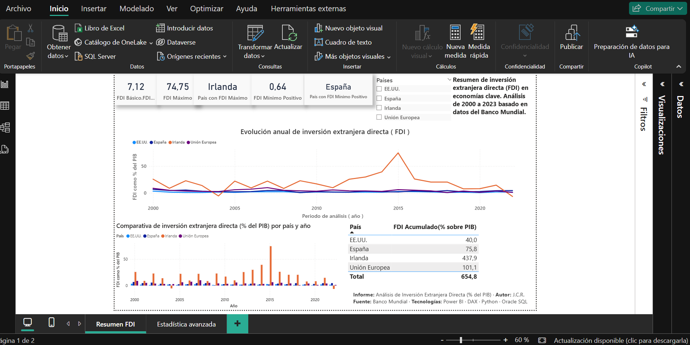
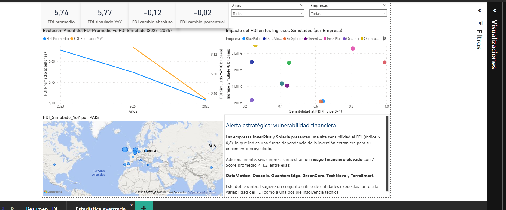
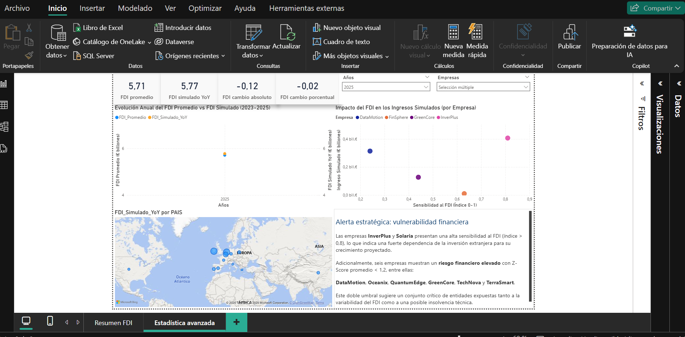


### Power BI Online Dashboard

[Explore Interactive Version](http://bit.ly/3UKiQNg)

### DAX Performance Analysis (DAX Studio)

```DAX
EVALUATE
ADDCOLUMNS(
    SUMMARIZE('Empresas', 'Empresas'[Empresa], 'Empresas'[Pais]),
    "Zscore", [Zscore_Promedio],
    "Simulado_YoY", [FDI_Simulado_YoY]
)
```
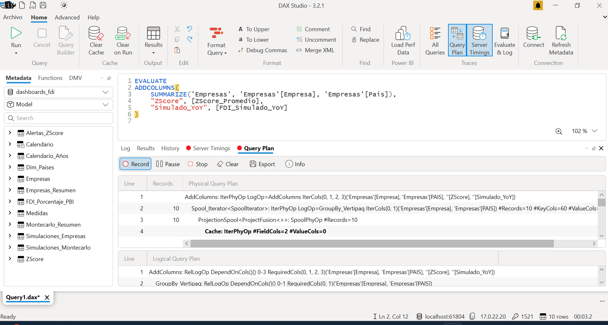
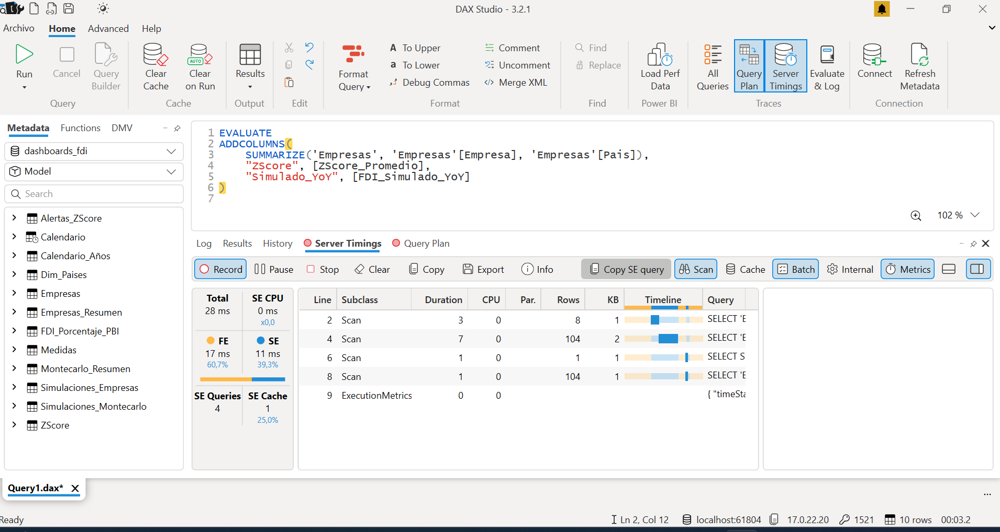


### 4.4 API Integration (FastAPI)

- FastAPI endpoint exposes simulation alerts from Oracle.
- Returns JSON format for browser/API consumption.
- Executed via `main.py` and `uvicorn` in `/api`.

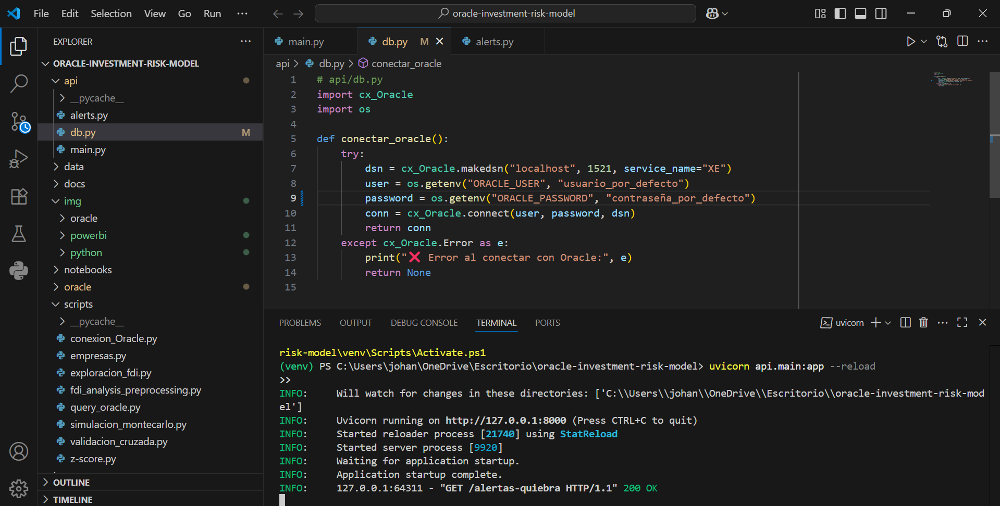
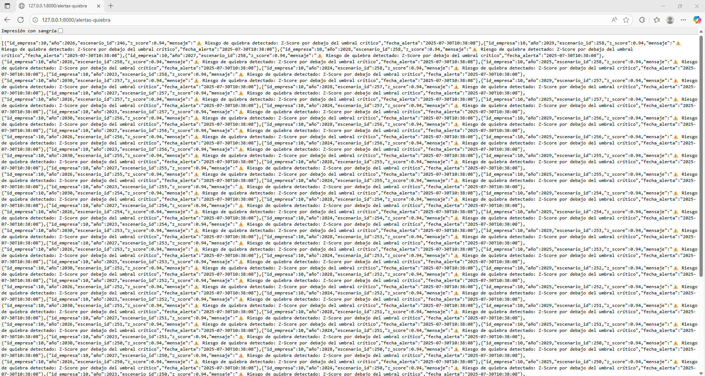


## 5. Results and Analysis

### 5.1 Country-Level Analysis

**Top 5 Countries by Average FDI (2020–2024)**

1. **Ireland** – 19.04%
2. **Netherlands** – 18.42%
3. **Belgium** – 10.65%
4. **European Union** – 4.39%
5. **Portugal** – 3.96%

**Exceptional Peak in Ireland (2015)** Ireland showed the highest standard deviation due to an unusual spike in 2015, coinciding with massive investment inflows.

**Context:**

- Between 2014–2015, Ireland's FDI stock doubled to €796B.
- Driven by multinational accounting movements (e.g., Apple).
- Institutional factors include 12.5% corporate tax and financial incentives (IFSC).

**Interpretation:** Structural and fiscal policies can amplify volatility. The average remains high, but dispersion is skewed by this outlier.

**Lowest FDI Countries (2020–2024)**

- **Greece** – 1.17%
- **Italy** – 1.19%
- **USA** – 1.73%
- **France** – 2.20%
- **China** – 2.42%

**Notes:**

- Greece's persistent low levels reflect structural recovery challenges.
- Italy showed a steep decline in 2020 (COVID-related).

**Python Graphs:** 


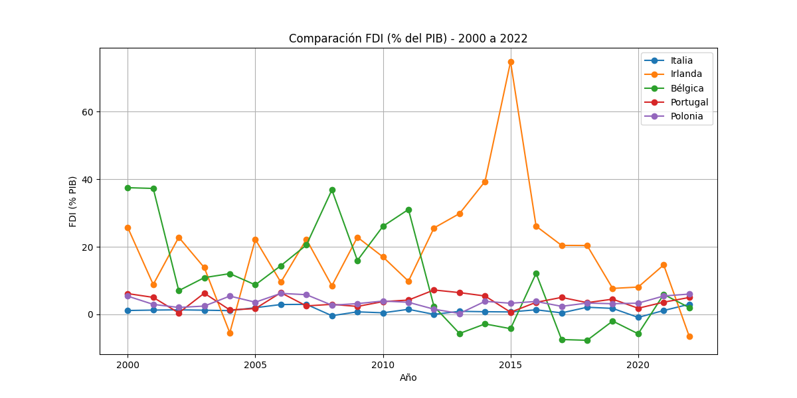
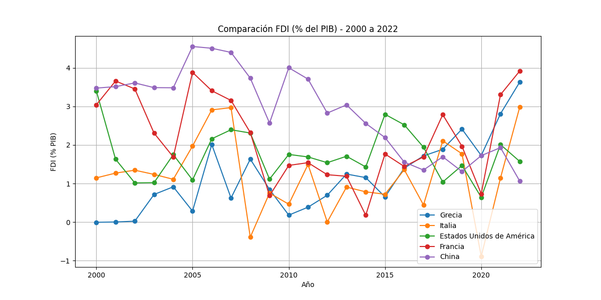
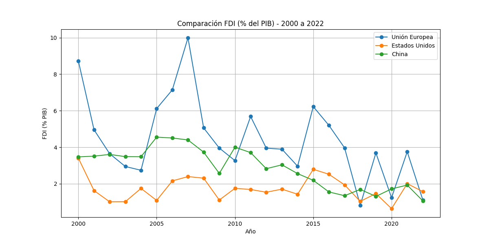

**Interpretation:** Italy, despite averaging higher than Greece, shows greater volatility, increasing uncertainty.

### 5.2 Monte Carlo Simulations (Country-Level)

Worst simulated average FDI:

- Greece – 1.18%
- Italy – 1.19%
- USA – 1.74%
- France – 2.11%
- Germany – 2.55%

**Insight:** Simulated results confirm weak attractiveness for FDI in historically low-performing countries.

### 5.3 Alert System (Oracle Triggers)

When simulated FDI drops below a threshold, alerts are inserted into `alertas_simulacion`.

Worst simulated values detected:

- Netherlands – -78.06%
- Belgium – -47.98%
- Ireland – -43.49%

**Interpretation:** Extreme drops indicate structural fragility or high sensitivity in the projection model.

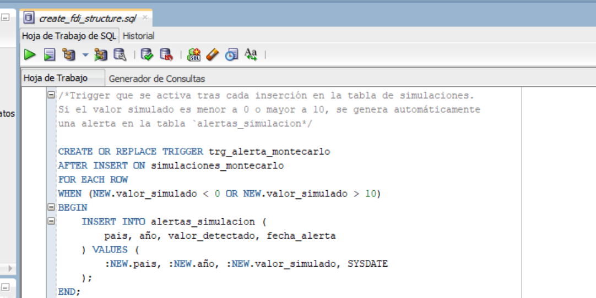
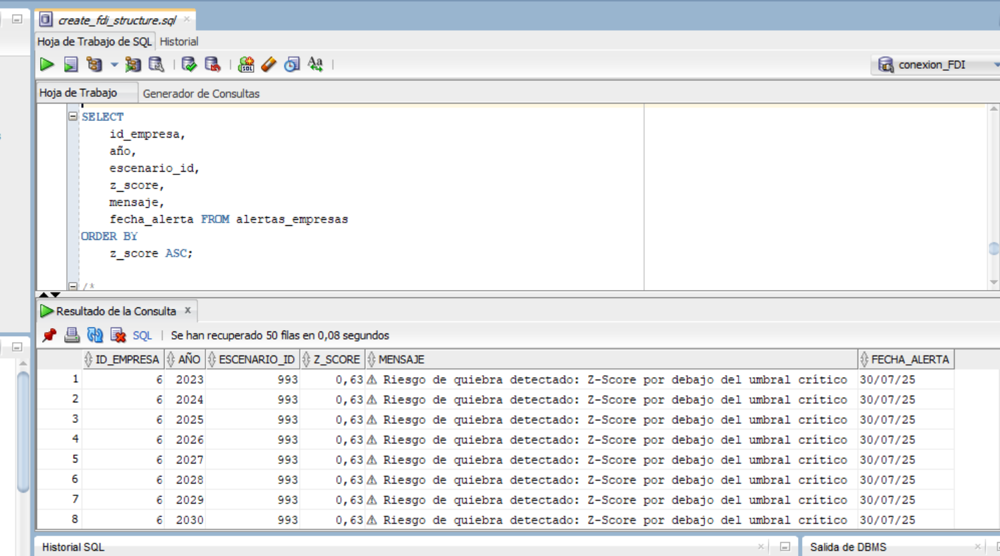


### 5.4 Company-Level Z-Score Risk

**High Risk (Z < 1.0):**

- DataMotion (CHN) – Z: 0.63
- Oceanix (DEU) – Z: 0.63
- QuantumEdge (IRL) – Z: 0.65
- TechNova (USA) – Z: 0.87

**Low Risk:**

- Solaria (USA) – Z: 42.42
- InverPlus (IRL) – Z: 2.55

**Note:** Altman Z-Score simulated per company using Oracle + sensitivity adjustments.

### 5.5 Z-Score Alert System (Triggers)

Companies with Z-Score < 1.8 triggered automated alerts in the database.

| Company     | Country | Z-Score | Message                    |
| ----------- | ------- | ------- | -------------------------- |
| DataMotion  | CHN     | 0.63    | ⚠ Below critical threshold |
| Oceanix     | DEU     | 0.63    | ⚠ Below critical threshold |
| QuantumEdge | IRL     | 0.65    | ⚠ Below critical threshold |

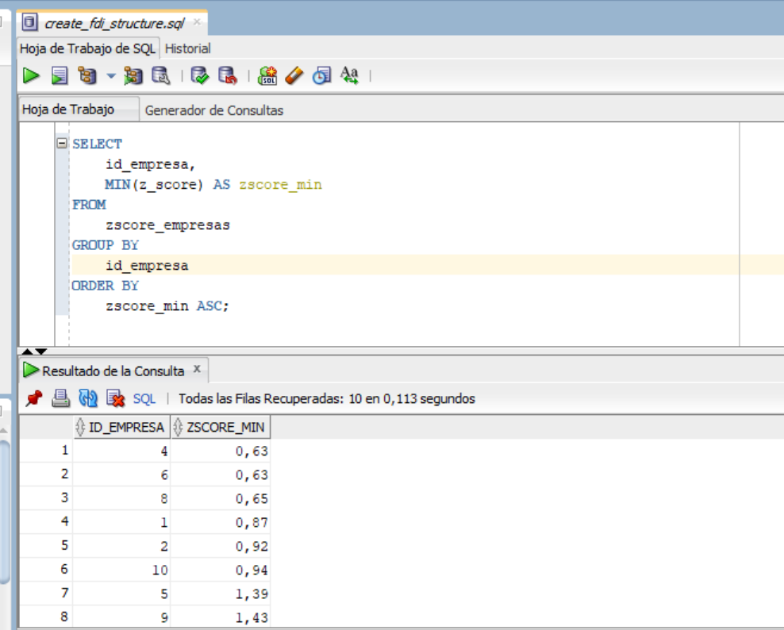

## 6. Conclusions

This project demonstrates how financial modeling, data engineering, and automated systems can be integrated to assess economic risk in a structured, scalable way.

- Monte Carlo simulations produced realistic future scenarios.
- Statistical indicators were used to trigger risk alerts via Oracle.
- Power BI and FastAPI enabled external visualization and interaction.

The system can be extended with predictive models, AI, or integration with enterprise systems.

## 7. Technologies Summary

| Tool / Language | Usage                                          |
| --------------- | ---------------------------------------------- |
| Python          | Data prep, simulation, statistical analysis    |
| Pandas / NumPy  | Data manipulation, VaR, Z-Score                |
| Oracle SQL      | Storage, queries, relational modeling          |
| PL/SQL Triggers | Real-time alerts for high-risk events          |
| Power BI        | Interactive dashboards and visual storytelling |
| FastAPI         | REST API exposure (JSON endpoints)             |
| VS Code         | Main development environment                   |

## 8. Project Structure

```
oracle-investment-risk-model/
├── api/                # FastAPI endpoints
├── scripts/            # Python simulation and connection logic
├── notebooks/          # (Optional) Jupyter notebooks
├── img/                # Visualizations: Power BI, Python, Oracle
├── data/               # (Optional) CSV inputs
├── docs/               # Technical notes and explanations
├── oracle/             # SQL schema and scripts
└── README.md           # Main documentation
```

---

**Author:** Jhojan Giovanni Cachay Rios  
Bachelor in Economics, Master in Finance & Accounting  
[LinkedIn](https://www.linkedin.com/in/jhojancachay)  
Spain 🇪🇸


